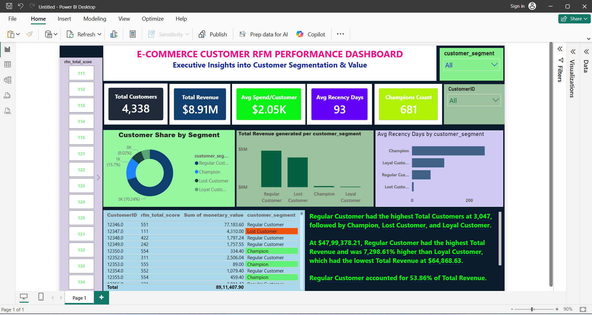

# E-Commerce Customer RFM Segmentation & Performance Analytics

## 📊 Dashboard Preview


## 🎯 Project Overview
This project provides data-driven executive insights into customer purchasing behavior using **RFM (Recency, Frequency, Monetary) Analysis**. By transforming **540,000+ rows** of raw transactional data, we successfully segmented customers into actionable cohorts like Champions, Loyal Customers, and Lost Customers to maximize retention and marketing ROI.

## 🛠️ Tech Stack Used
* **SQL (MySQL Server):** Advanced Data Cleaning, Staging Tables, CTEs, Window Functions (`NTILE(5)`)
* **Power BI Desktop:** DAX Measures, Advanced Data Modeling, Smart AI Narratives, Data Visualisation
* **Data Source:** Kaggle E-Commerce Dataset (540,000+ rows)

## 🧠 SQL Logic & Methodology
1. **Data Cleaning:** Removed missing `CustomerID`s and handled negative values (cancelled/returned orders).
2. **RFM Metrics:** Calculated exact Recency, Frequency, and Monetary values using `DATEDIFF`, `COUNT(DISTINCT)`, and `SUM`.
3. **Customer Segmentation:** Leveraged SQL window functions (`NTILE(5)`) to rank customers into 125 distinct combinations and grouped them into strategic business cohorts.

### 📈 Data Volume Verification (Proof of 540,000+ Rows)
To verify the massive scale of the transactional dataset, the following verification query was executed immediately after data ingestion:

```sql
-- Query to verify the exact number of imported rows from Kaggle Dataset
SELECT COUNT(*) FROM retail_data;
```

**Output in MySQL Workbench:**
* **`541,909 rows`** successfully imported into the primary table.
* After strict data cleaning (removing null customer IDs and negative values), **`397,884 rows`** were retained for downstream RFM modelling in Power BI.
